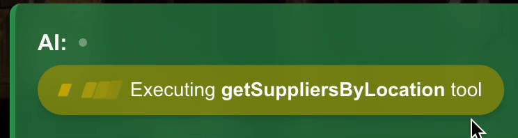
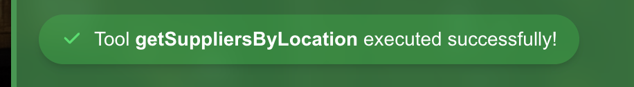
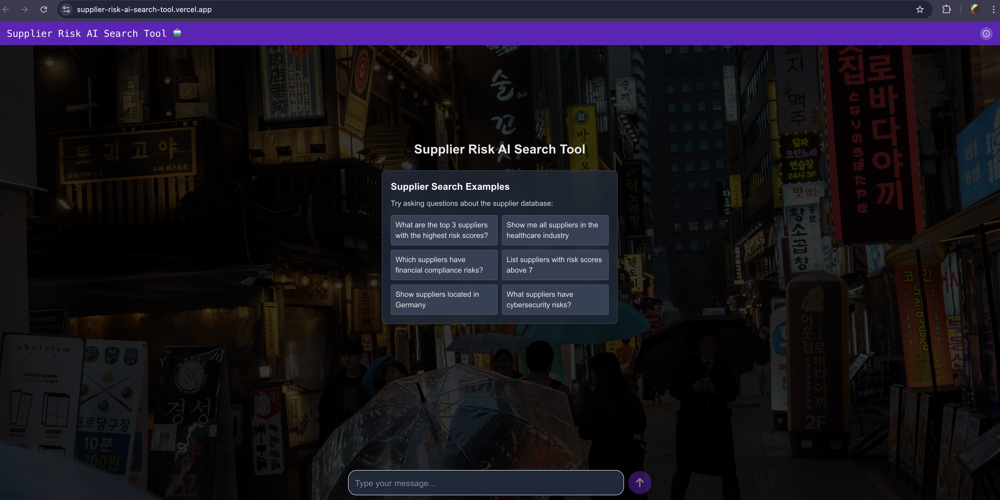
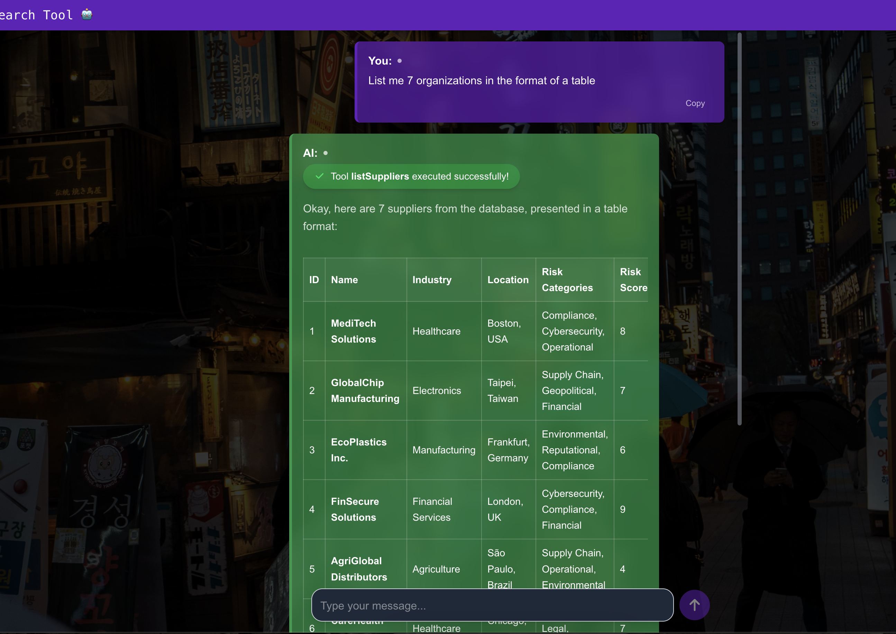
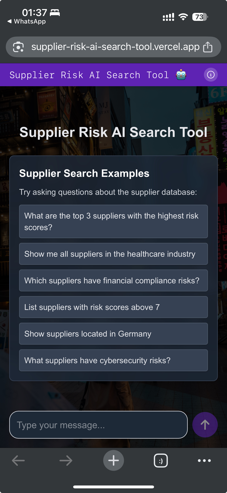
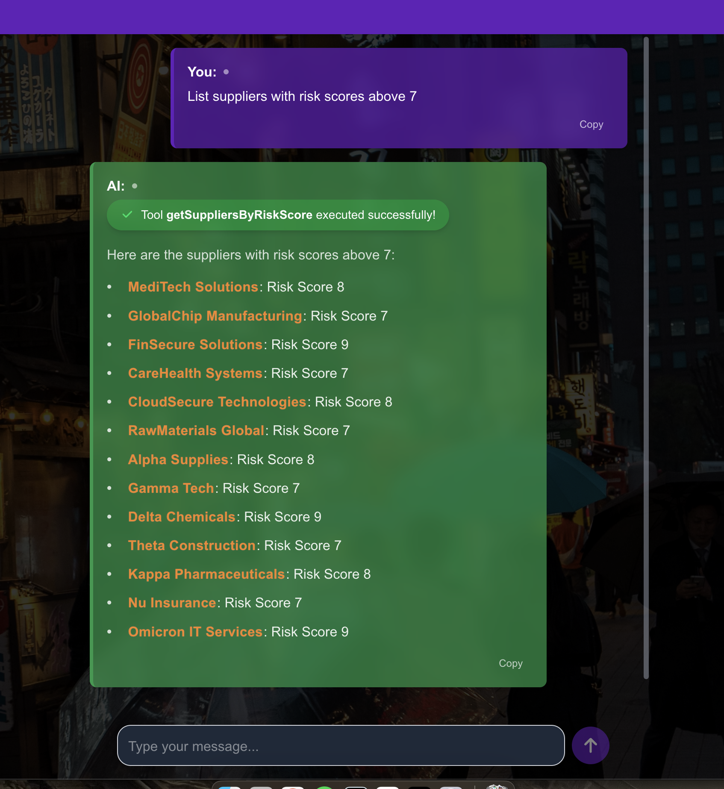

# Supplier Risk AI Search Tool
An AI-powered supplier risk assessment and search tool built with Next.js, and the [Vercel AI SDK](https://sdk.vercel.ai), leveraging Google's Gemini model and custom tool/function calling.

## Overview
This application provides a conversational interface to query a database of suppliers, allowing users to search and filter suppliers based on risk score, industries, locations, and more. The tool leverages Google's Gemini 2.0 Flash model with the [Google Generative AI Provider](https://sdk.vercel.ai/providers/ai-sdk-providers/google-generative-ai.)

### Technical Challenges and Development Process
I started by creating a functional UI using the **useChat() hook** while interacting with the AI model, without any tools implemented. During this step, I addressed several implementations related to how we display the AI's response, which usually comes as **Markdown**. My approach involved using the **react-markdown** library along with other plugins, and I also implemented a custom CSS file to modify the HTML format of the response. This included highlighting strong words with different colors, as well as adding effects and color patterns to the text. Also, I implemented a basic feature to copy the message text.

The second step focused on implementing the tools. I started by improving and refactoring the mock database I created, which consists of a JSON file and a "model" file that simulates queries and ORM operations using native JavaScript native functions like .filter and .slice to filter the items from the JSON. I also leveraged TypeScript for type safety with these items. The model's functions are directly used by the **tool functions** implemented in StreamText.

During this implementation, it's important to be aware of the **maxSteps configuration** and fine-tune it based on the complexity of our prompts. In our case, 3 steps are more than enough. This function is crucial for leveraging Multi-Step Calls where we:
- First, we send the prompt to the model, which generates a tool call and executes it.
- The tool result is sent back to the model, which generates a response considering the tool result.

In some cases, more steps may be necessary until we have a plain-text response.
Another important concept is defining an initial prompt using the system field on the StreamText, where we specify the behavior of our model.

**Tool Call Progress**

To implement feedback for tool calls, showing when they are in progress and when they are finished, we should make use of the message part called tool invocation. Based on its state (partial-call, call, result), we can display whether the tool is in progress or has been completed.
<p align="center">
  <table>
    <tr>
      <td></td>
      <td></td>
    </tr>
  </table>
</p>


## Features
- **Conversational AI Interface**: Chat with the AI to query supplier information
- **Risk Assessment**: Identify suppliers based on risk scores and categories
- **Filtering Capabilities**: Search by:
  - Risk score thresholds
  - Top/lowest risk suppliers
  - Industry
  - Location
  - Risk categories (Financial, Compliance, Operational, etc.)
  - And more
- **Responsive Design**: Works on desktop and mobile devices
- **Markdown Support**: Well-formatted responses with a beautiful markdown rendering

## Technologies
- **Framework**: Next.js 15 with App Router
- **AI**: Google Gemini 2.0 Flash via [Vercel AI SDK](https://sdk.vercel.ai)
- **Frontend**: React 19, TailwindCSS 4
- **TypeScript**: Type safety
- **Libraries**:
  - `ai`: v4.3.9 - Core AI functionality 
  - `@ai-sdk/google`: v1.2.13 - Google AI models integration
  - `@ai-sdk/react`: v1.2.9 - React hooks for AI
  - `react-markdown`: v10.1.0 - Markdown rendering
  - `rehype-highlight`: v7.0.2 - Syntax highlighting
  - `remark-gfm`: v4.0.1 - GitHub Flavored Markdown support
  - `zod`: v3.24.3 - Schema validation
  - `react-loading-indicators`: v1.0.0 - Loading state indicators

## Getting Started

### Prerequisites

- Node.js 18.x or higher
- npm or yarn

### Installation

```bash
# Clone the repository
git clone https://github.com/cdznd/supplier-risk-ai-search-tool.git
cd supplier-risk-ai-search-tool

# Install dependencies
npm install

# Start development server with TurboRepo
npm run dev
```

The application will be available at http://localhost:3000

### Building for Production

```bash
# Create production build
npm run build

# Start production server
npm start
```

## Project Structure

```
src/
├── app/                # Next.js app router
│   ├── api/            # API routes
│   │   └── chat/       # Chat API endpoint
│   ├── layout.tsx      # Root layout
│   └── page.tsx        # Main chat interface
├── components/         # React components
│   ├── chat/           # Chat-related components
│   └── layout/         # Layout components  
├── lib/                # Shared libraries
│   ├── db/             # Mock database
│   │   ├── data.json   # Supplier data
│   │   └── models/     # Data models functions
│   ├── ai.ts           # AI model configuration
│   └── tools.ts        # AI tool definitions
└── styles/             # Global styles
```

## API Tools

The application provides several AI tools for supplier queries:

- `listSuppliers`: Get a list of suppliers with optional limit
  - example: "List me 5 organizations" or "List me 7 organizations in the format of a table"
- `getSuppliersByRiskScore`: Filter suppliers by risk score threshold
  - example: "List suppliers with risk scores **above** 7"
- `getTopRiskiestSuppliers`: Get suppliers with highest risk scores
  - example: "What are the top 3 suppliers with the **highest risk scores**?"
- `getLowestRiskSuppliers`: Get suppliers with lowest risk scores
  - example: "Show the 3 suppliers with the lowest risk scores"
- `getSuppliersByIndustry`: Filter suppliers by industry
  - example: "Show me all suppliers in the **healthcare industry**"
- `getSuppliersByRiskCategory`: Filter suppliers by risk category
  - example: "Which suppliers have financial compliance risks?"
- `getSuppliersByLocation`: Filter suppliers by location
  - example: "Show suppliers located in Germany"
- `getSuppliersByMultipleRiskCategories`: Filter by multiple risk categories
  - example: "Which suppliers have financial compliance risks?"

## Screenshots

## Screenshots

<p align="center">
  <table>
    <tr>
      <td></td>
      <td></td>
    </tr>
    <tr>
      <td></td>
      <td></td>
    </tr>
  </table>
</p>
